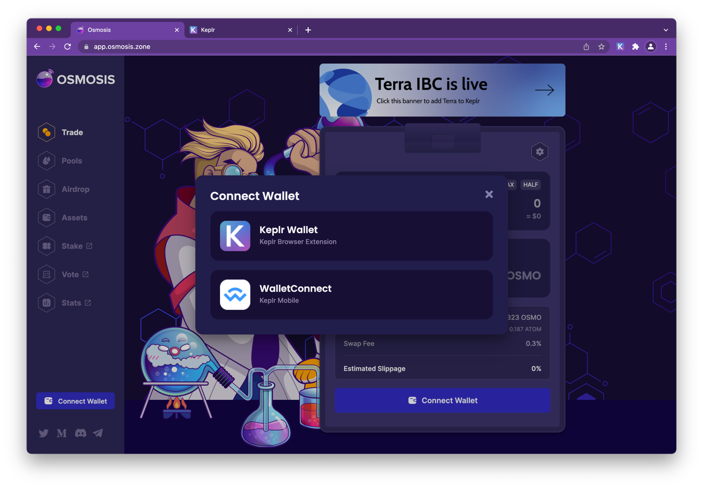
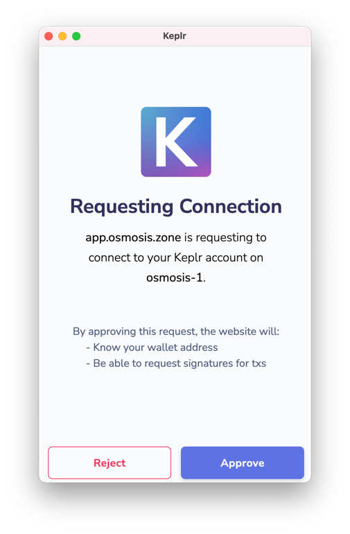
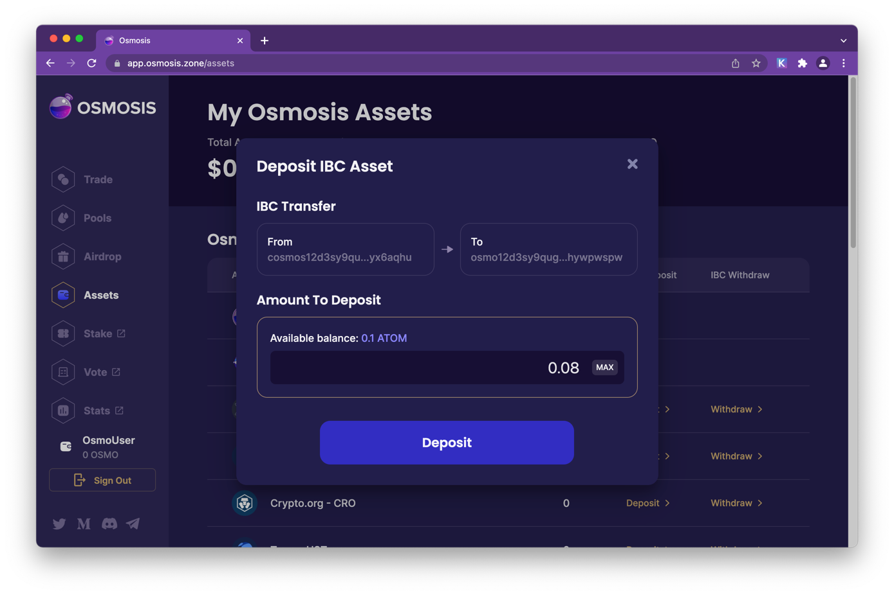
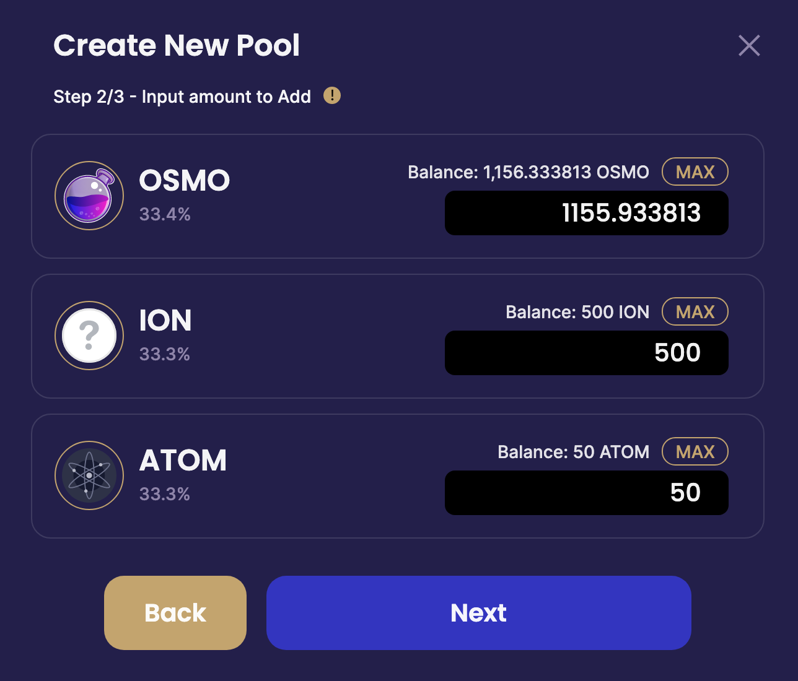

# Getting Started
Before opening the Osmosis AMM App, make sure to install the [Keplr Wallet](../../wallets/keplr).

## Open the App
Go to [https://app.osmosis.zone/](https://app.osmosis.zone/)

## Connect Wallet

Click Approve. This confirms that you are connecting to the app.osmosis.zone and the chain osmosis-1.

::: danger 
Always make sure you are connected to app.osmosis.zone name and network (osmosis-1)
:::

## Deposit Funds

Click Assets. Then click on the deposit link next to the asset name. For this example we are clicking the ATOM deposit link. 

Accept connection to cosmoshub-4

Once connected, select how much you would like to deposit, then click the deposit button

Approve the transaction

Once the transaction is completed a series if confirmations notifications will  be displayed including the IBC confirmation.

## Swapping Tokens

Pending....

# Adding Liquidity to a Pool
Select a pool from the list and click Add/Remove Liquidity

Input a quantity of one of the assets. The quantity of the other asset(s) will auto-complete. (Pools require assets to be deposited in pre-determined weights.)

To remove liquidity, input the percentage amount to withdraw.

Incentivized pools receive OSMO liquidity mining rewards. Rewards are distributed to bonded LP tokens in these pools that meeting the bonding length criteria.

## Bonding LP Tokens
Users can choose to bond their LP tokens after depositing liquidity. LP tokens remain bonded for a length of their time of their choosing. Bonded LP tokens are eligible for liquidity mining rewards if they meet the minimum bonding length requirement.

Click Start Earning and choose a bonding length.

When a user wants to stop bonding an LP token, they submit a transaction that begins the unbonding period. After the end of the timer, they can submit another transaction to withdraw the tokens.

## Create a New Pool

Creating pools in Osmosis is permissionless, meaning any user can create a pool with two or more supported assets.
Go to Pools > Create a Pool. Select from your wallet the assets that will comprise the pool. Choose a weight for each asset.

Choose a quantity of each asset to deposit into the pool.

Input a swap fee for the pool. (An explanation of swap fees can be found [here](https://osmosis.gitbook.io/o/liquidity-providing/fees).)

Click Create a Pool and voilà! The pool is launched. The parameters chosen when creating the pool (token weights, swap fees) cannot be changed later.

### Adding Liquidity to a Pool
Select a pool from the list and click Add/Remove Liquidity

Input a quantity of one of the assets. The quantity of the other asset(s) will auto-complete. (Pools require assets to be deposited in pre-determined weights.)

To remove liquidity, input the percentage amount to withdraw.

Incentivized pools receive OSMO liquidity mining rewards. Rewards are distributed to bonded LP tokens in these pools that meeting the bonding length criteria.

 
